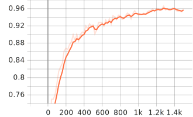
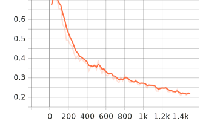
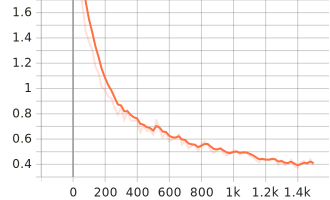

# Parking Availability Detector

## Description
A parking availability detector made with <a href="https://github.com/facebookresearch/detectron2/blob/main/README.md" target='_blank'>Detectron2</a> and trained on the <a href="https://public.roboflow.com/object-detection/pklot" target='_blank'>PKLot Dataset</a> downloaded from Roboflow in the COCO format

Detectron contains a set of pre-trained object detection models that you can easily train on your own COCO datasets. In this repository I used the Faster R-CNN model with a ResNet-50 backbone. The model was trained on 8691 Images hand-labeled by the Authors of the Dataset. To read more about the dataset and the model, see the links above.

## Installation
1. Clone the repository
2. Install the requirements
    ```bash
    pip install -r requirements.txt
3. Download the dataset from <a href="https://public.roboflow.com/object-detection/pklot" target='_blank'>here</a>
    - Under Export, select COCO as the format
    - Show Download Code
    - Run this command in your terminal, but replace the link with your own, and run the command from the root of the repository
        ```bash
        mkdir Data/; cd Data/; curl -L [YOUR LINK HERE] > roboflow.zip; unzip roboflow.zip; rm roboflow.zip
        ```
4. Next you can start training the model. The model will be saved in the `Output/` directory
    ```bash
    python pklot.py --mode train
    ```
    - Note: This model was trained on a GPU with 8gb vram and 32gb Ram which wasn't a problem, but I had problems with 16gb of Ram and 8gb  vram
    - If you run into OOM errors, try reducing the batch size by setting --batch_size to a lower number
5. To test the model you can run

    ```bash
    python pklot.py --mode test
    ```
    - To skip to the next image in openCV press `0` on your keyboard
    - The images will be saved to the `Output/visualizations` directory
    - If you want to run inference also set the `--inference` flag to `True`

## Results

To evalueate our Detector I used the `IoU` metric. The `IoU` metric is the intersection over union of the predicted bounding box and the ground truth bounding box. The `IoU` metric is calculated as follows:

<p align="center">
    
</p>
Our result looked as follows (table):

| AP | AP50 | AP75 | APs |APm|AP1|
| --- | --- | --- | --- |---|----|
| 70.909 | 94.694 | 89.211 | 61.936 |73.719|80.306|

An IoU over 0.5 is generally considered to be a good prediction. And therefore an accuracy of **94.694%** for an IoU of 0.5, and an accuracy of **89.211%** for an IoU of 0.75 is a good result.

## Training Graphs
#### Fast RCNN CLS Accuracy

#### LOSS BOX REG

#### TOTAL LOSS


## Help
If you need any help running this repository you're welcome to open an issue or if you have something to add open a pull request.